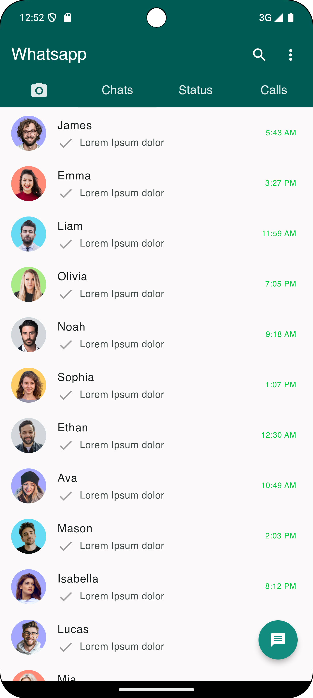
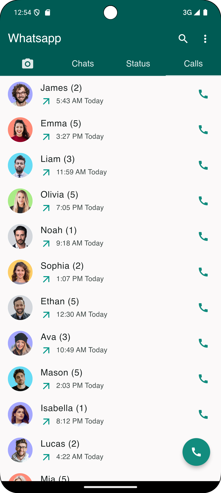
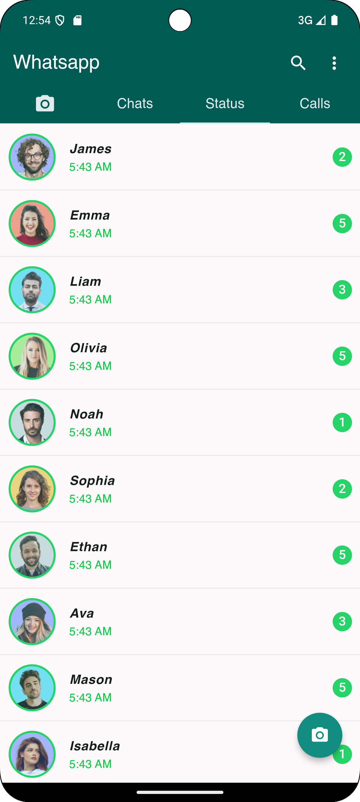
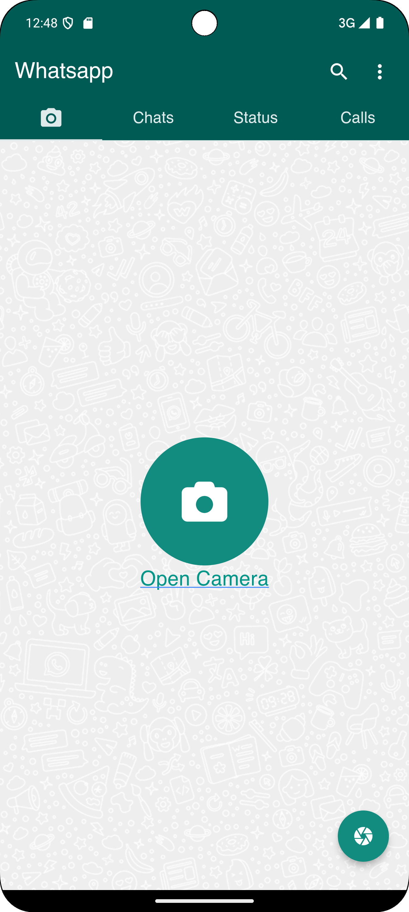
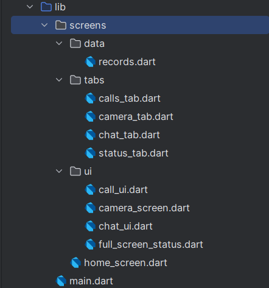
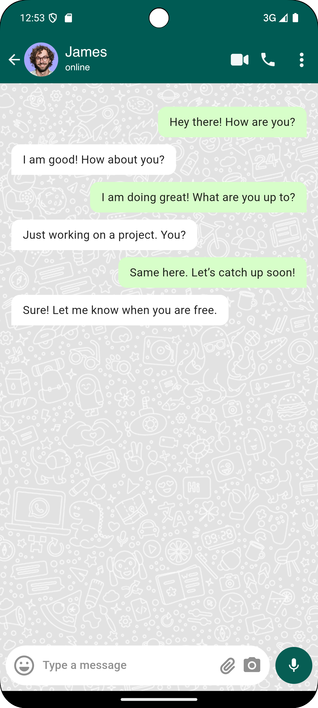
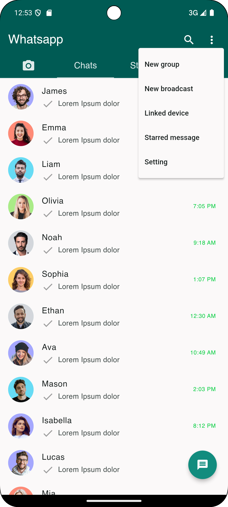
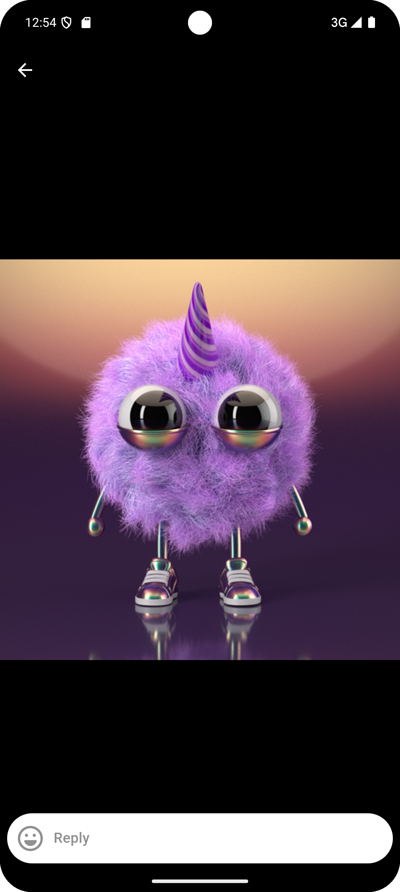
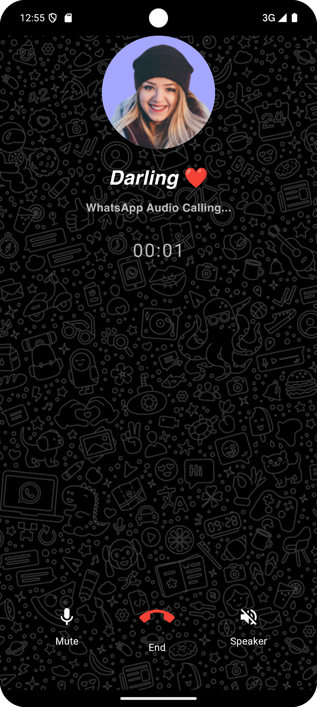

# WhatsApp Clone

A WhatsApp Clone built with Flutter, replicating core functionalities such as messaging, calling, status updates, and more. This project is designed for learning purposes and demonstrates how to implement features such as chat UI, audio calls, status updates, and camera integration.

---

## Features
- **Chat**: Real-time chat UI with message bubbles and timestamp.
- **Calls**: Audio calling feature with call timer and mute/speaker options.
- **Status**: Status updates with images, auto-dismiss after 30 seconds, and option to mute status.
- **Camera**: Access the camera to capture and share photos.
- **Navigation**: Tab-based navigation between Chats, Status, Calls, and Camera.

---

## Screenshots
<!-- Add your screenshots here -->
| Chat Screen                       | Call Screen                       | Status Screen                       | Camera Screen                          |
|-----------------------------------|-----------------------------------|-------------------------------------|----------------------------------------|
|  |  |  |     |

---

## Folder Structure

---

---

## Contact
For any inquiries or feedback, feel free to contact me at:
- Email: shehriyarsaleem@gmail.com
- GitHub: [@Shehryar-dev](https://github.com/Shehryar-dev)
- LinkedIn: [Shehryar khan](https://www.linkedin.com/in/shehryarkhandiv/)
- Portfolio: [Portfolio](https://shehriyar-portfolio-v2.netlify.app/)
---

